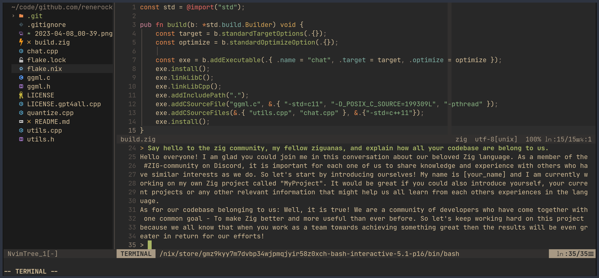

<h1 align="center">GPT4All.zig</h1>
<p align="center">ZIG build for a terminal-based chat client for an assistant-style large language model with ~800k GPT-3.5-Turbo Generations based on LLaMa</p>
<p align="center"></p>

# Run a GPT4All model locally

Yes! ChatGPT-like powers on your PC, no internet and no expensive GPU required! 

Here it's running inside of NeoVim:




And here is how it runs on my machine (low quality GIF):


# Try it yourself

Here's how to get started with the CPU quantized GPT4All model checkpoint:

## For Windows Users

- **Download the released chat.exe from the [GitHub
  releases](https://github.com/renerocksai/gpt4all.zig/releases) and start using
  it without building:**
    - _Note that with such a generic build, CPU-specific optimizations your
      machine would be capable of are not enabled._
    - Make sure, the model file
      [gpt4all-lora-quantized.bin](https://the-eye.eu/public/AI/models/nomic-ai/gpt4all/gpt4all-lora-quantized.bin)
      and the [chat.exe](https://github.com/renerocksai/gpt4all.zig/releases)
      are in the same folder. If you didn't download the model, chat.exe will
      attempt to download it for you when it starts.
    - Then double-click `chat.exe`

## macOS, Linux, brave Windows users - optimized builds

Building on your machine ensures that everything is optimized for your very CPU.

0. Make sure you have Zig master installed. Download from
   [here](https://ziglang.org/download/).
1. **Optional:** Download the LLM model `gpt4all-lora-quantized.bin` file from
   [here](https://the-eye.eu/public/AI/models/nomic-ai/gpt4all/gpt4all-lora-quantized.bin)
   or [Torrent-Magnet](https://tinyurl.com/gpt4all-lora-quantized).
2. Clone or download this repository
3. Compile with `zig build -Doptimize=ReleaseFast`
4. Run with `./zig-out/bin/chat` - or on Windows: start with: `zig-out\bin\chat`
   or by double-click the resulting `chat.exe` in the `zig-out\bin` folder.

If you didn't download the model yourself, the download of the model is
performed automatically:

```shell
$ ./zig-out/bin/chat 
Model File does not exist, downloading model from: https://the-eye.eu/public/AI/models/nomic-ai/gpt4all/gpt4all-lora-quantized.bin
Downloaded:   19 MB / 4017 MB   [  0%]
```

If you downloaded the model yourself and saved in a different location, start with:

```shell
$ ./zig-out/bin/chat -m /path/to/model.bin
```


**Please note**: This work merely adds a `build.zig` and the automatic model
download to the excellent work done by Nomic.ai:
- [GPT4All](https://github.com/nomic-ai/gpt4all): Everything GPT4All
- [gpt4all.cpp](https://github.com/zanussbaum/gpt4all.cpp): Source code of the
  chat client

---

## How to use other models like gpt4all-lora-unfiltered

Check out [GPT4All](https://github.com/nomic-ai/gpt4all) for other compatible
models. Use the following command-line parameters:

- `-m model_filename` : the model file to load.
- `-u model_file_url` : the url for downloading above model if auto-download is
  desired.

## Where to take it from here

This code can serve as a starting point for zig applications with built-in LLM
capabilities. I merely added the `build.zig` to the existing C and C++ chat code
provided by [gpt4all.cpp](https://github.com/zanussbaum/gpt4all.cpp), and added
the auto model download feature.

From here,

- write leightweight zig bindings to load a model, based on the C++ code in
  `cpp_main()`.
- write leightweight zig bindings to provide a prompt and context, etc. to the
  model and run inference, probably with callbacks.


## Closing remarks

Since I was unable to use the binary chat clients provided by GPT4All on my
NixOS box:

```
gpt4all-lora-quantized-linux-x86: error while loading shared libraries: libstdc++.so.6: cannot open shared ob ject file: No such file or directory
```

That was expected on NixOS, with dynamically linked executables. So I had to run
`make` to create the executable for my system, which worked flawlessy. Congrats
to Nomic.ai! 

But with the idea of writing my own chat client in zig at some time in the
future in mind, I began writing a `build.zig`. I really think that the
simplicity of it speaks for itself. 

The only difficulty I encountered was needing to specify
`D_POSIX_C_SOURCE=199309L` for `clock_gettime()` to work with zig's built-in
clang on my machine. Thanks to @charlieroth, I bumped the value up  to
`200809L`, to make it work on his 2020 MacBook Pro. Apparently, the same value
is used in mbedtls, so it's now consistent across the entire repository.
